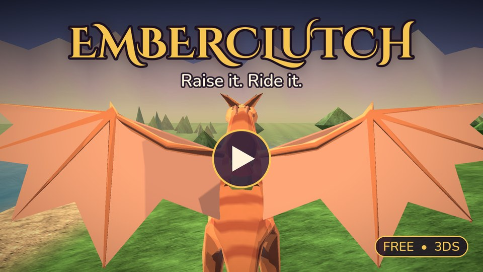
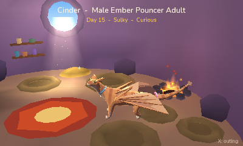
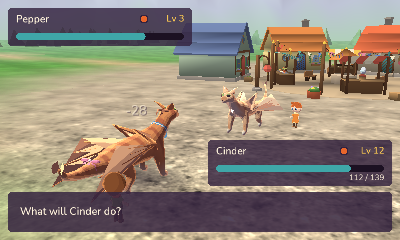
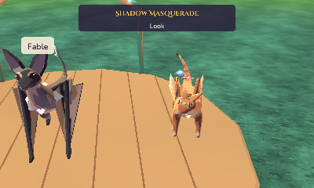
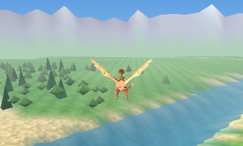

# Emberclutch: Skyreach Valley

*Raise, train and ride dragons in a cozy valley — a homebrew game for the Nintendo 3DS.*

Made by Noah Hicks. Inspired by Emi, who makes every day feel like hatching day.

**[Watch the trailer on YouTube](https://youtu.be/GZZhfeaHGZA)** (1:27, filmed in the game itself)

Emberclutch is a free, open-source dragon life game for the 3DS family (it runs on the
original old 3DS). Hatch an egg, care for a tiny hatchling with the stylus, and watch it grow
into a grown dragon over about a week of real days. Walk it through Skyreach Valley on its
lead, ride it into the sky when it's grown, and train it into a champion of battles and
beauty shows. Nothing ever dies: a neglected dragon only sulks until you make up.

## What's in it

- **Hands-on care.** Feed, pet, brush and bathe your dragon on the touch screen. It has its
  own needs (Belly, Clean, Play and Love, and Energy that sleep brings back), moods, a
  personality and a heart-shaped glow that shows how it feels.
- **Fourteen kinds of dragon** in four colourings each (one of them rare), with stats,
  manners and traits. Breed pairs at the Nesting Stone for new kinds and surprises.
- **Skyreach Valley**, an open world of eighteen places: the Market, the Sanctuary, a
  windmill, an orchard, a grotto behind the falls, floating isles, and more. Walk it with
  your partner, ride a grown dragon anywhere, find treasures and the day's little finds.
- **The Lantern Festival**, a first story with the valley's villagers.
- **Battles:** turn-based duels in the valley, four moves each, elements and stats, the
  Ember to Starfire league and its finals at Emberpeak Caldera; wild dragons floor by floor
  in Frostspire Hollow.
- **Beauty shows** at Moonpetal Glade: themed pageants, accessories and dyes.
- **Challenges:** Sky Rings races, Fruit Catch and the Lantern Trial, with cups and trophies.
- **Fishing** at Driftwood Cove, the Wanderings (your dragon walks while you do), a den to
  decorate, a Dragondex to fill, photos and a real-time day and night.

| | |
|---|---|
|  |  |
|  |  |

## Built for the original 3DS

Everything here runs on the first 3DS from 2011: a 268 MHz ARM11 processor, a PICA200 graphics chip with no
programmable pixel shaders, 64 MB of memory for the game and 6 MB of video memory. Fitting a living 3D world
into that took some doing:

- **Skinned 3D dragons**, animated on the graphics chip's vertex shader with each bone's matrix packed into
  its 96 constant registers (25 bones a draw), up to three grown dragons in the den at once, about 3,000
  triangles each up close.
- **A 2.3 km valley** streamed in tiles at four levels of detail, with eighteen places, villagers and
  critters, held to a triangle budget every frame (about 9,600 in the valley: a heavy view
  draws its distant ground simpler until it's back under), in stereoscopic 3D, which draws the top screen
  twice.
- **An animated 3D HOME Menu banner**, a hatchling in its egg, inside the HOME Menu's 512 KB, after tracking
  down why some banners froze the HOME Menu (where their pictures sat inside the file).
- **Music streamed** and mixed in small slices, and the ground's and rocks' painted textures generated at
  start rather than stored.
- **Tested every step:** more than 387,000 automated checks on a PC, scripted runs in a headless emulator, and
  over thirty rounds of play-testing on a real old 3DS.

## Install

You need a 3DS with custom firmware (for example [Luma3DS](https://3ds.hacks.guide/)).

- **FBI (QR code):** open FBI, choose *Remote Install → Scan QR Code*, and scan this. It always
  fetches the [latest release](https://github.com/RedLynx101/emberclutch/releases/latest).

  

- **By hand:** download `emberclutch.cia` from the
  [latest release](https://github.com/RedLynx101/emberclutch/releases/latest), copy it to the
  SD card and install it with FBI. Or copy `emberclutch.3dsx` to `sdmc:/3ds/` and start it
  from the Homebrew Launcher.
- **Universal Updater:** search for *Emberclutch*, once it's listed there.

Sound needs the 3DS's DSP firmware (`sdmc:/3ds/dspfirm.cdc`, made by
[DSP1](https://github.com/zoogie/DSP1)); without it the game runs silently. Your save lives
in `sdmc:/3ds/emberclutch/` (two copies, so an interrupted save never loses both).

## The guide

New to the valley? ***A Keeper's Handbook*** is the player's guide: the world, caring for your
dragon, riding, battles, shows and challenges, with the Keeper's Almanac at the back for the
numbers behind it all (what each trait does, the elements' chart, every move). Read it
[here](docs/guide/guide.md), or download the [PDF](docs/guide/Emberclutch-Guide.pdf) (also on each
release), light on spoilers.

## Controls

| | |
|---|---|
| **Stylus** | Care for your dragon (pet, brush, feed, bathe, play), menus, the map |
| **Circle pad** | Walk; in the den, look around |
| **A** | What's near (talk, go in, light a lantern, ride); flap when flying |
| **B** | Run; dive when flying |
| **L / R** | Turn the view; when flying, R bursts ahead and L brakes |
| **X** | The Journal in the valley, the outing in the den |
| **START** | The system menu: settings, the Dragondex, save and quit |

The first steps of the game show short tips as things come up; the settings can show them
again.

## Build it yourself

See [docs/DEVELOPING.md](docs/DEVELOPING.md): devkitPro with the `3ds-dev` group, then `make`.
`make` builds the dev build (a dev menu on SELECT, a performance overlay, a tracer and Y
screenshots); `make DEV=0` builds the player build that the releases carry.
PC unit tests and scripted emulator runs are described there too.

## Contributing

Bug reports and ideas are welcome: open an issue with its form. To send a fix or a feature, see
[CONTRIBUTING.md](CONTRIBUTING.md) (building, tests, the house style, licensing) and the
[Code of Conduct](CODE_OF_CONDUCT.md). Security problems: [SECURITY.md](SECURITY.md).

## Credits and licences

Made by Noah Hicks, with Claude (Anthropic) writing much of the code and tools. See
[CREDITS.md](CREDITS.md) for everything else that went into it and
[THIRD-PARTY-NOTICES.md](THIRD-PARTY-NOTICES.md) for the libraries' licences.

- **Code:** [MIT](LICENSE)
- **Original art and assets:** [CC BY-SA 4.0](assets/LICENSE-ART.md)
- **Music and generated sound effects:** their own terms, see
  [LICENSE-MUSIC](assets/audio/music/LICENSE-MUSIC.md)
- The concept images in `docs/art/concept/` are AI-generated reference material; they are
  not part of the game and not offered under these licences.

Emberclutch is a fan-made homebrew project. It is not affiliated with or endorsed by
Nintendo. "Nintendo 3DS" is a trademark of Nintendo.
