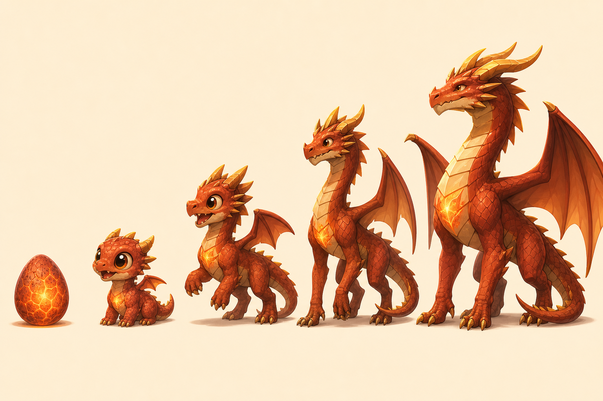

# Emberclutch

*Raise, breed and fly with dragons — on your Nintendo 3DS.*



Emberclutch is an open-source homebrew dragon-raising life sim in the spirit of classic
pocket pet games. Hatch an egg, care for a super-cute hatchling, watch it grow into a
majestic adult over about two weeks of real time, train it, enter competitions, breed a
den full of unique dragons, and ride them anywhere across Skyreach Valley.

Built natively for the 3DS (C++17, libctru, citro3d, citro2d). **The old 3DS is the
performance floor.**

> Status: **Foundations done; Alpha 1 (*a living pet*) next.** Design docs, concept art,
> a portable simulation core with unit tests, processed music, and a themed 2D prototype
> that runs in the Azahar emulator. See [STATUS](docs/STATUS.md) and the
> [roadmap](docs/plan/roadmap.md).

## Highlights (planned)

- **Heartglow** — every dragon has a heart-shaped ember light that shows its mood.
- **Five life stages** — Egg → Hatchling → Juvenile → Adolescent → Adult. Growth depends
  on real days *and* on care, and the dragon grows a little every day.
- **21 breeds** from 6 elements (Ember, Tide, Gale, Grove, Frost, Lumen) plus Mendelian
  hybrids, with inherited horns, frills, wings, tails, patterns, colors and rare traits.
- **A whole den** — keep many dragons and eggs; store extras in the Sanctuary and the Cold
  Vault.
- **Forgiving** — nothing dies. Neglected dragons get upset until you make up.
- **Competitions without riding** — Sky Rings, Fruit Catch, Command Trial, Shine Show,
  Lantern Trial. **Ride anywhere** in free roam.
- Touch, optional voice commands, pedometer Wanderings, local-wireless Sky Visits.

## Docs

| Doc | What's in it |
|---|---|
| [Game design](docs/design/game-design.md) | Pillars, loops, stages, needs, mood, training, competitions, riding, den |
| [Breeds & genetics](docs/design/breeds-and-genetics.md) | Elements, hybrid table, traits, inheritance rules |
| [Theme & art direction](docs/design/theme-and-art-direction.md) | Palette, heartglow, shape language, UI, audio |
| [Architecture](docs/tech/architecture.md) | Layers, rendering budget, asset pipeline, save format |
| [Screens & flow](docs/design/screens-and-flow.md) | Every screen and how they connect |
| **[Status](docs/STATUS.md)** | Live state and next actions |
| [Roadmap](docs/plan/roadmap.md) · [Decisions](docs/plan/decisions.md) | Playable milestones and the decision log |
| [Content & assets](docs/plan/content-and-assets.md) | Models, animations, scenes, effects, UI, audio, items |
| [Alpha 1 plan](docs/plan/alpha-1.md) | Current work plan and definition of done |
| [Suno music brief](docs/audio/suno-music-brief.md) | Prompts and settings for the soundtrack |
| [Equine line](docs/future/equine-line.md) | Future horses, pegasi, unicorns and alicorns |

## Building

Requirements: [devkitPro](https://devkitpro.org/wiki/Getting_Started) with the `3ds-dev`
group (MSYS2 on Windows). For the PC unit tests, a desktop g++ (MSYS2 `ucrt64`).

```powershell
powershell -ExecutionPolicy Bypass -File tools\build.ps1   # emberclutch.3dsx + .smdh
powershell -ExecutionPolicy Bypass -File tools\test.ps1    # core unit tests on the PC
```

Or from an MSYS2 shell: `source /etc/profile.d/devkit-env.sh && make`.

## Running in an emulator

`tools\emu.ps1` builds and opens the game in [Azahar](https://azahar-emu.org/)
(`winget install AzaharEmu.Azahar`). The mouse is the stylus; R = `W`, X = `Z`,
A = `A`, START = `M`. Add `-ResetSave` to start fresh. The emulator is fine for checking
logic and UI, but frame rate must be judged on a real old 3DS.

## Running on a 3DS (over Wi-Fi)

- **Quick test:** open the Homebrew Launcher, press **Y** (netloader), then run
  `tools\run.ps1 [-Address <3ds-ip>]`.
- **Install to the SD card:** start **ftpd** on the 3DS, then run
  `tools\deploy_ftp.ps1 -FtpHost <3ds-ip>`. It uploads `emberclutch.3dsx` to
  `sdmc:/3ds/emberclutch/`, to run from the Homebrew Launcher; with `-Cia` also every CIA in
  `build/cia-test/` to `sdmc:/cias/`. Each file's size is checked on the 3DS.
- **Install on the HOME Menu (CIA):** `tools\package_cia.ps1` builds `emberclutch.cia`
  (icon, banner and sound included; makerom and bannertool are taken from the 3D-Claw
  project next to this one, or PATH). Copy it to the SD card and install it with **FBI**
  (Luma3DS). `-Banner3D` packs the animated 3D banner instead of the flat one (build it with
  `tools\make_banner.ps1`, which needs pycgfx in `build\tools\pycgfx`; see the script).

Controls: Continue or New game (your name, then pick an egg: tap twice), rub the egg warm,
turn it and listen to it, watch it hatch and name it, then care for the hatchling with the
tool tray. **START** opens the system menu (settings, save & quit); **SELECT** the dev menu
in dev builds. **Y** saves a screenshot of both screens anywhere, to
`sdmc:/3ds/emberclutch/screenshots/` with a line of numbers in its `log.txt`;
`tools\pull_shots.ps1 -FtpHost <3ds-ip>` copies them off as PNGs. Dev shortcuts: **R+A**
skips 1 hour, **R+X** skips 1 day.

Unattended checks: `tools\autotest.ps1 tests\autotest\tour.txt -ResetSave` plays a scripted
session in Azahar and saves screenshots of each step to `build/autotest/`.

## Layout

```
src/core/    portable simulation (no libctru) — genetics, needs, growth, time
src/app/     3DS app (citro2d prototype for now)
tests/       PC unit tests for src/core
tools/       build, test, deploy, audio (make_loop.py), and later Blender/asset scripts
docs/        design, tech, plans, concept art
assets/      source assets (icon; music sources are git-ignored)
romfs/       files packed into the app (processed music, models, textures)
```

## License

- **Code:** [MIT](LICENSE)
- **Original art and assets:** [CC BY-SA 4.0](assets/LICENSE-ART.md)
- **Music:** separate terms, see [LICENSE-MUSIC](assets/audio/music/LICENSE-MUSIC.md)
- **Concept images** in `docs/art/concept/` are AI-generated reference material and
  are not shipped with the game.

Emberclutch is a fan-made homebrew project. It is not affiliated with or endorsed by
Nintendo. "Nintendo 3DS" is a trademark of Nintendo.
