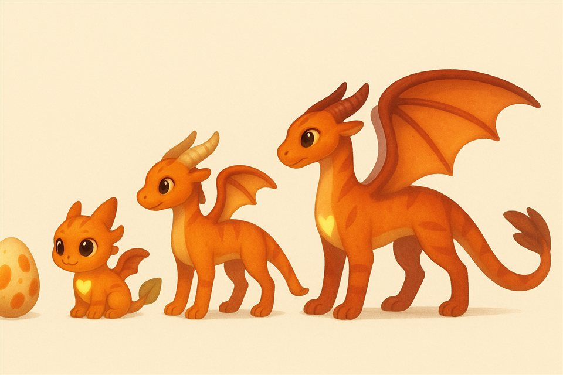
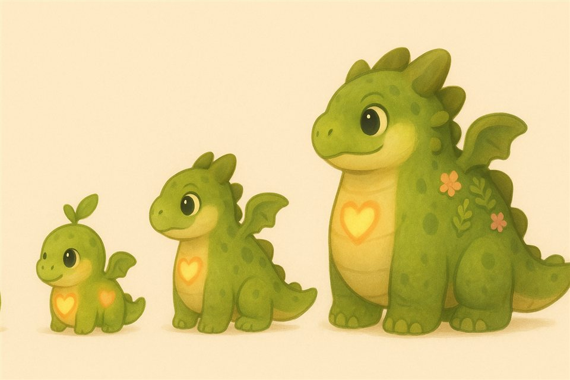
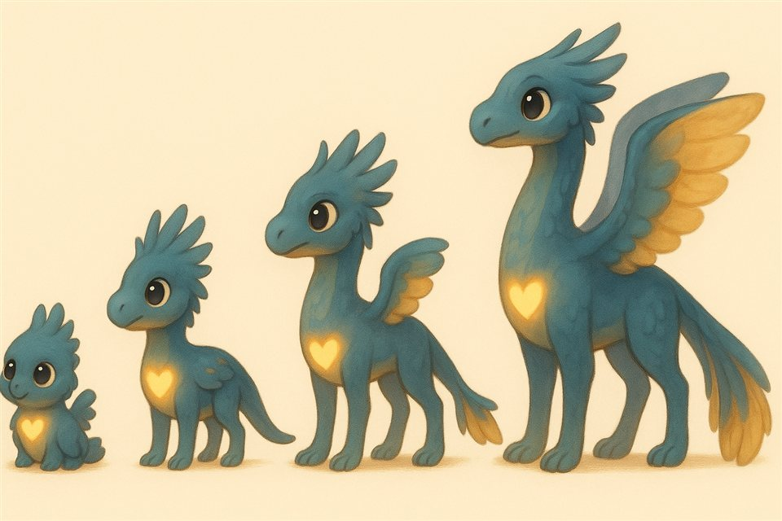
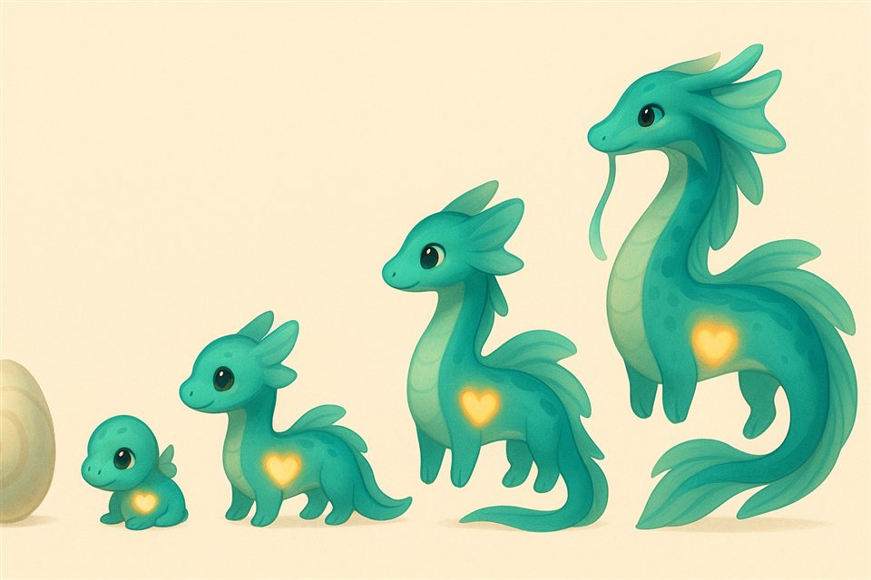
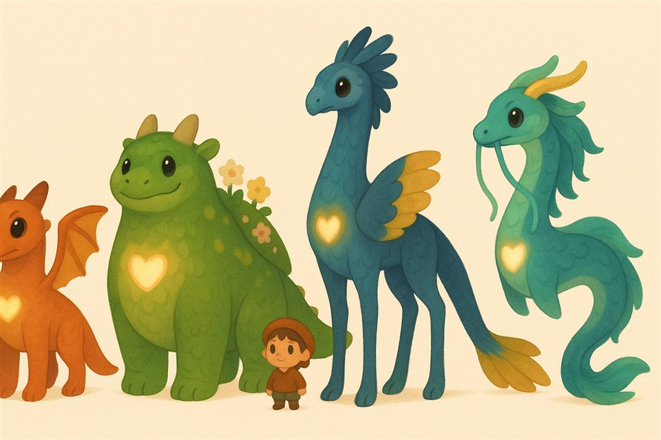
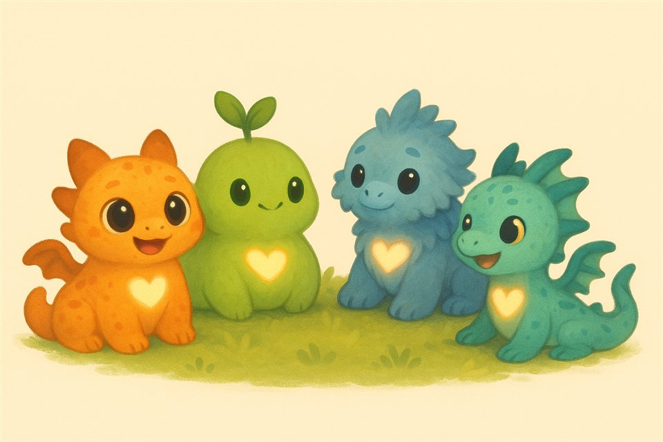

# Review R11 — New dragons (D76; before Beta's step 2)

**For Noah, 2026-09-25.** Four wholly new dragon silhouettes for the storybook look (D75),
crossing a cozy life-sim's softness (round, chunky, hand-painted, simple faces) with a
dragon film's lovable dragons (big expressive eyes, cat- and dog-like, one clear silhouette
per kind) and a touch of awe in the grown adults. These are **concept sheets** (AI images,
reference only, `tools/concept/make_concepts.py --dragons`); after your answers below, each
kind is built in Blender by script and rendered in every stage (R11b), then goes into the
game. The heartglow stays on every one.

Working names; yours to change.

## The Pouncer: sleek and cat-like
A kitten of a hatchling (big head, huge eyes, a leaf-tipped tail) that grows into a lithe,
panther-like adult with big scalloped wings and a twin-finned tail. The agile one: quick
turns in the air, pounces in play. The "classic dragon" of the four.

## The Puffback: round and gentle
A bun-shaped baby with a leaf sprout that grows into a big, round, sleepy gentle giant with
mossy plates, flowers and ferns on its back and small, fast wings. The cuddly one: slow and
steady in the air, carries a lot, naps anywhere.

## The Crestwing: feathered and elegant
A fluffy, crested baby that grows long legs and a long neck: a tall, graceful adult with
wings edged in feathers, a feather crest and a fan of plumes at the tail's tip. The pretty
one: the best glider, shows off.

## The Ribbontail: long and flowing
A little noodle with fin-like ears that grows into a long, serpentine adult with ribbon
fins down its back and tail and long whiskers, swimming through the air in an S. The
majestic one, like a river spirit.

## Together
Grown, with you for scale (the Crestwing's snout here is a touch beaky; its own sheet is
the reference):

As hatchlings:

## What stays, and how they'd be built
- **The heartglow**, the element colours and the genetics (breeds, colours, patterns,
  parts, rare traits), the stages (egg, hatchling, juvenile, adolescent, adult), the care
  and everything they do.
- **Built by script in Blender** as now, one kind per Opus 5.5 subagent, each checked
  against the triangle budget (adult about 3,000 at full detail, babies less) and rendered
  in every stage: front, side and three-quarter, a turntable, and in the den.
- **Hand-painted textures** in the new look (soft gradients, stripes, spots, moss) instead
  of today's scale texture, tinted by the element colours.

## Questions
1. **The four kinds:** A) all four as shown; B) change or swap one (which, and toward what?).
2. **How they fit the game:** A) they replace today's looks (Classic, Pebbleback, Tallneck,
   and wild): any breed can hatch as any kind, inherited from the parents with surprises,
   and the wild glowing-cracks look becomes a rare trait on any kind *(my pick)*; B) each
   element has its own kind (Grove → Puffback, Tide → Ribbontail, …); C) new kinds beside
   today's dragons, which keep their look.
3. **The dragons in your save:** A) each takes the kind closest to its look (Classic →
   Pouncer, Pebbleback → Puffback, Tallneck → Crestwing; a wild one gets a kind by its id
   and keeps its glow) *(my pick)*; B) every one gets a kind by a roll fixed by its id.
4. **Bodies and animation:** A) all four share one skeleton (four legs, two wings, a tail)
   so the 51 animations work for every kind, tuned per kind; the Ribbontail keeps its four
   short legs and adds a body wave in flight *(my pick)*; B) truly different bodies (a
   two-legged Crestwing, a legless Ribbontail), each with its own animations: several
   times the work.
5. **Eyes:** A) big glossy eyes whose pupils change with mood (round and soft when happy,
   narrow when startled or cross), like the film's dragons *(my pick)*; B) simple dot eyes,
   like the life-sim's villagers; C) big round eyes as in the sheets, pupils fixed.
6. **Babies:** A) each kind has its own baby body (the kitten, the bun, the fluffball, the
   noodle), changing into the juvenile at the first molt as now *(my pick)*; B) one baby
   shape for all four.
7. **Eggs:** A) each kind has its own egg (smooth and speckled, round and mossy, tall and
   spotted, pearly with a spiral) in the element's colours, so an egg hints what hatches
   *(my pick)*; B) one egg shape for all.
8. **Sizes when grown:** A) close (within about a third of each other), so the den, beds
   and camera fit as they are *(my pick)*; B) big differences (a Puffback twice a Pouncer),
   with the den reframed.
9. **Riding:** A) all four can be ridden, each flying its own way (the Pouncer quick, the
   Puffback slow and steady, the Crestwing gliding far, the Ribbontail weaving) *(my
   pick)*; B) only some.
10. **Names:** Pouncer, Puffback, Crestwing, Ribbontail: keep, or yours?
11. **Beta, on foot (D75):** A) the camera keeps one angle as in the life-sim, always
    looking north and tilted down at you *(my pick)*; B) it turns to stay behind you.
