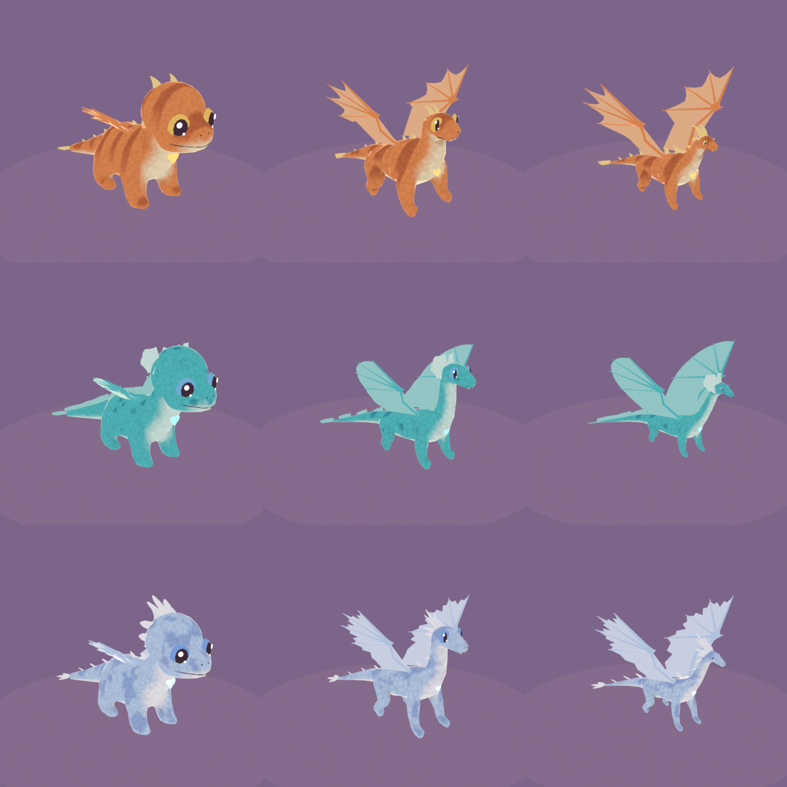
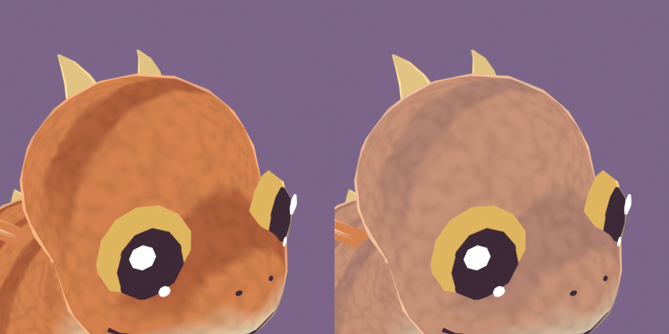

# R2 — Textured dragons

Sent 2026-09-24. **Not blocking** (D32): comments are folded in when they arrive, and the
style review R5 (Alpha 2) revisits the look as a whole.

*Top to bottom: Ember (Stripes), Tide (Spots), Gale (Dapple). Left to right: hatchling,
juvenile, adult.*

*The same hatchling clean (left) and after a couple of days without grooming (right):
dust dulls each body region until it's brushed or bathed (D46).*

## What's new
- **Skin texture:** every dragon now has soft scale detail (cells on the back and sides,
  plates on the belly) and ambient shading in its creases, baked per body form.
- **The Pattern gene shows:** Stripes, Spots or Dapple in the dragon's pattern colour;
  Solid shows none. (Runes arrive with the Alpha 2 parts library.)
- **Dust (D46):** eight body regions (head, neck, back, belly, each side, tail, wings) get
  dusty over a day or two, the belly and tail fastest. Grooming dusts the whole dragon off;
  brushing single regions and the bath come with WP7. The dev menu's "Dusty / bath"
  button shows it without waiting.

## How it's made
`tools/blender/dragon_texture.py`: 3D procedural patterns baked through automatic UVs by
Cycles into one 256×256 texture per body form (128×128 for LOD1): stripes, spots and
dapple in red, green and blue, scale detail × occlusion in alpha. The GPU picks the
dragon's pattern channel and blends its colour in, then the dust, then the detail, then
the toon light (architecture §4).

## Noah's verdict
*(pending)*
