# Review R5 — the dragons' style (blocks, D47)

**For Noah, 2026-09-24.** The last thing built before the big dragon update. Everything in
Alpha 2 that doesn't depend on how the dragons look is done (WP1–WP10). Before the full
parts library, all 21 breeds, the patterns and the rare traits are built on top of the
dragons, choose their look: **keep the current style, move to one of the three variants,
or mix their best parts.**

All four use the same skeleton, the same animation clips and the same triangle budget
(≤ 2,910 triangles at full detail, 25 bones), so any of them can ship.

## The four looks
| | What changes | In the game |
|---|---|---|
| **Current** (textured, Alpha 1) | — | toon light in two bands, a thin warm rim |
| **V1 surface** | today's shapes; a new skin: bold outlined scale plates, a banded belly, a darker spine; rounder pupils with a third glint | softer three-band light, a wider rim |
| **V2 shape** | new proportions: babies chubbier with bigger heads and eyes, short legs, tiny wings; grown dragons with long necks, deep chests, slim waists, long tails, bigger wings and horns | as current |
| **V3 bold** | the **ember-veined dragon**: dark scales with the fire showing through thin glowing cracks, glowing eyes and wing membranes, dark horns, spikier, a leaner neck, a long tail | harder, darker light; the veins glow in place of the rim |

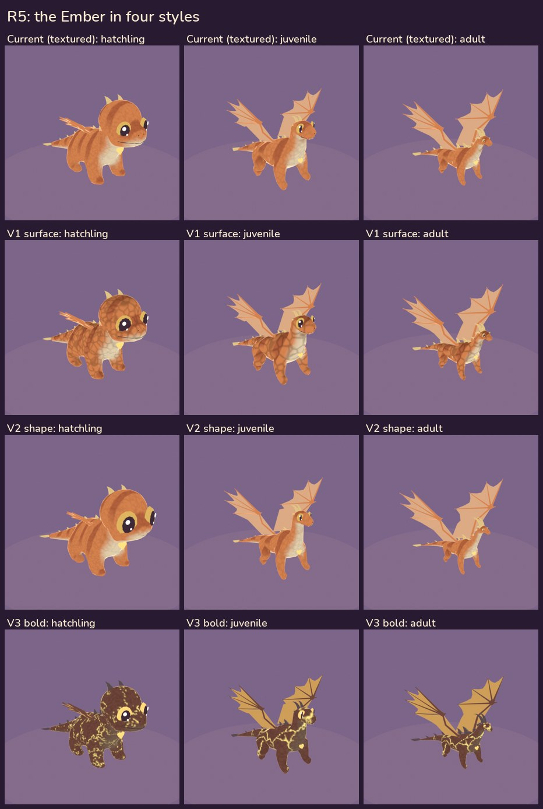

## Each style, male and female
Males have bigger horns (and frills, on the breeds that have them); females a bigger tail tip.

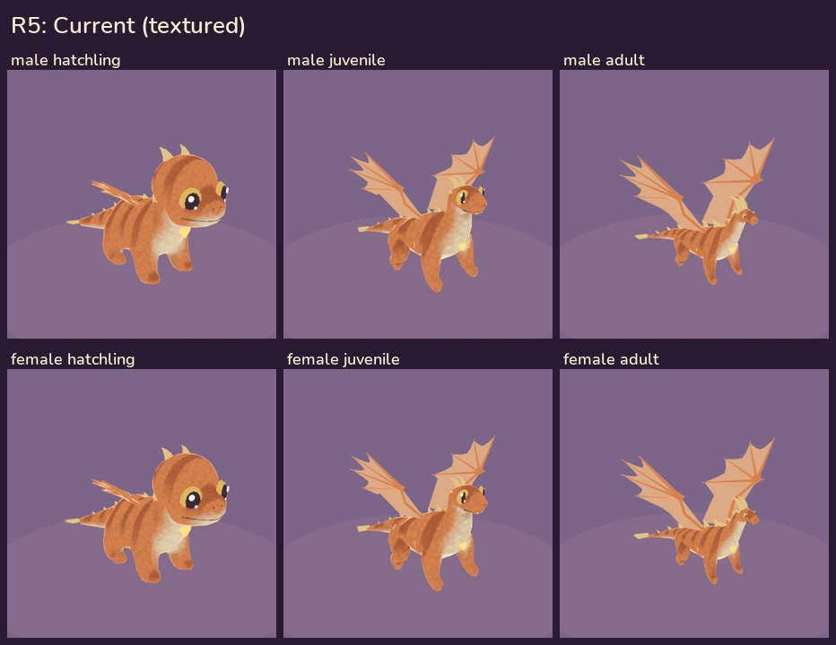
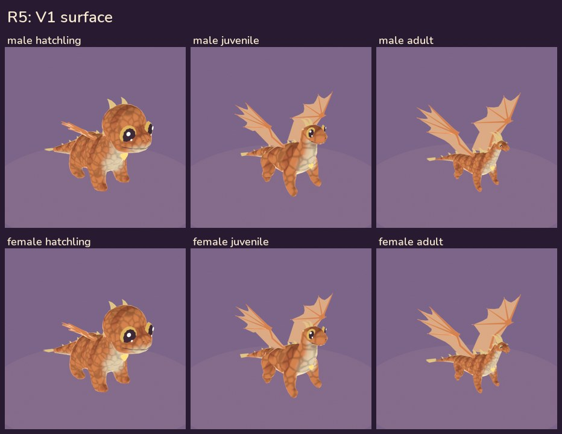
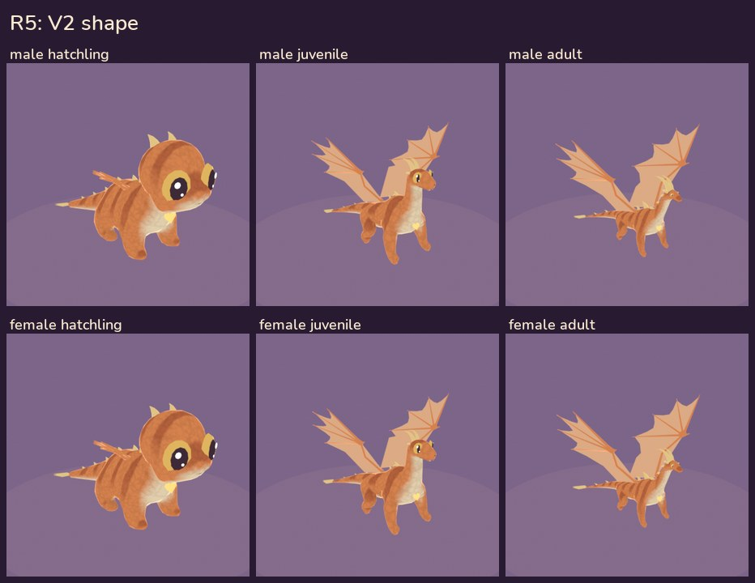
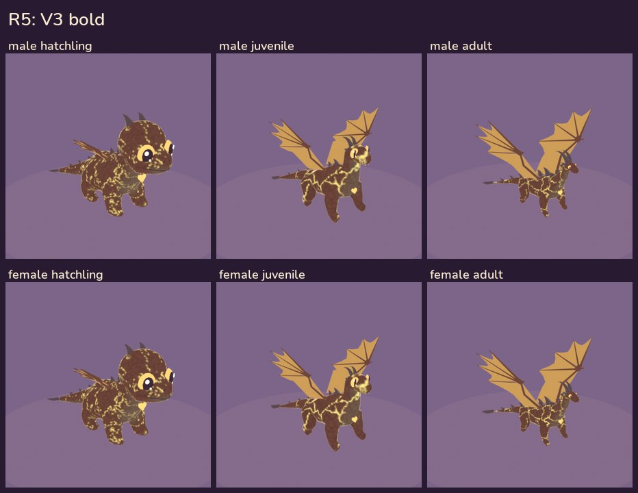

## Turntables (adult)
| Current | V1 surface | V2 shape | V3 bold |
|---|---|---|---|
| 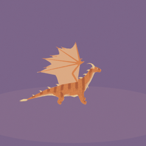 | 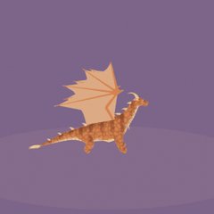 | 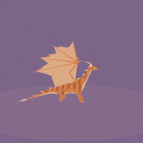 | 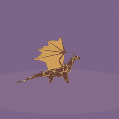 |

## In the game
Captured in Azahar (`tests/autotest/styles.txt`): an adult and two hatchlings in the den, the
adult up close. **To see them move on the 3DS:** SELECT opens the dev menu, R turns to page 2,
**Next style (R5)** cycles current → V1 → V2 → V3 (every dragon in the den, the close-up, the
Sanctuary and the Nesting Stone).

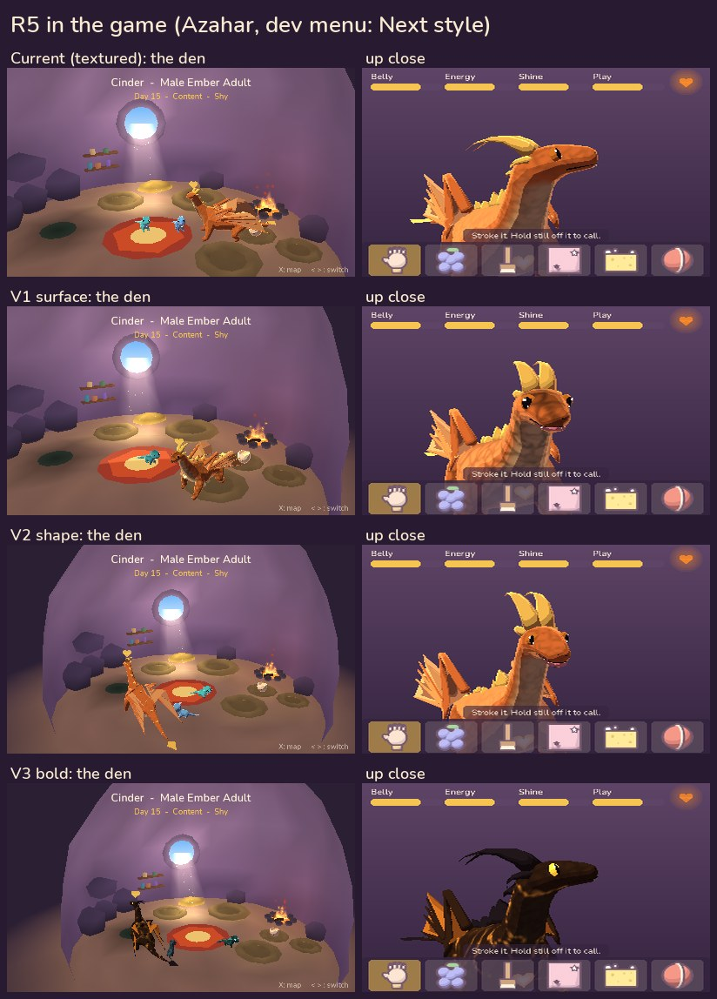

## The icon and the banner (WP10, D48, D50)
The emblem doesn't depend on the style. The 3D banner is built from the current style; it's
re-exported in the chosen one. The HOME Menu can't run in the emulator, so the 3D banner is
proven on your old 3DS in WP13 (the flat banner is the fallback).

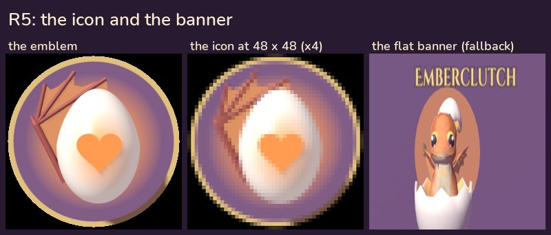
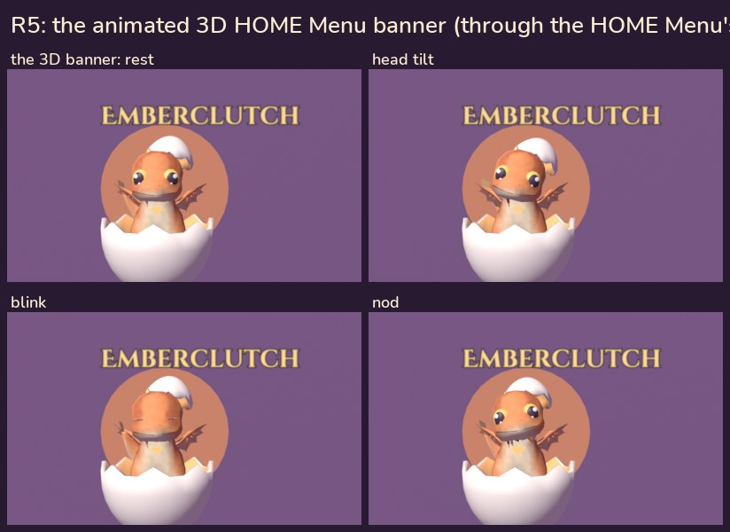

## Choosing
Any of these works:
- **Keep the current style.**
- **Move to V1, V2 or V3.**
- **Mix:** for example V2's proportions with V1's surface; or keep the current look and make
  V3's ember-veined skin a **rare trait** (a dragon that hatches with fire in its cracks).

After you choose: the dragons update in that style (the full parts library, all 21 breeds,
the patterns, rare traits, dirt and mud; D46, D47), the banner is re-exported in it, then the
run on your old 3DS (D34) and the Alpha 2 tag.

## How it's built
- `tools/blender/dragon_model.py --style v1|v2|v3`: proportions go into the build tables (the
  runtime scales the bones the same way at every growth stage), eye, horn, ridge and wing
  sizes into the geometry; `dragon_texture.py` makes each style's skin (V3: veins in the skin's
  blue channel). `export_dragon.py --style ... --out-dir romfs/models/vN` exports a style.
- `src/app/render3d.cpp setStyle`: reloads the forms from the style's folder and rebinds the
  clips; per style the toon and rim ramps; V3 darkens the palette and adds the veins after the
  light (the last colour-combiner stage, where the rim was).
- `tools/review_r5.py` assembles these pictures.
