# Review R7 — the valley's look (Beta WP2, blocks the world's art)

> **Decided 2026-09-25 (D75):** look **A**, storybook, "with Animal Crossing like textures, feel,
> speech, player movement, etc, but with dragons and such". The places, the people and the
> palette as they are here; more villagers later lean into high fantasy, not only humans.
> What it means part by part: [look and feel](../../design/look-and-feel.md). The dragons get
> a new look to match ([R11](R11-new-dragons.md), D76).

**For Noah, 2026-09-25.** Concept images for Beta, *The valley*: the places, the people and
the times of day, to pick a direction before any of the valley's art is built. They're
AI-generated as **reference only** (D74): nothing in them ships; the game's art is built by
script in Blender, as the dragons are. (`tools/concept/make_concepts.py`.)

Two looks to choose between, or mix:
- **A — Storybook:** soft, rounded, flat colour, painterly light. Warm and cute; the world
  would be smoothed a little beyond what the dragons are now.
- **B — Faceted low-poly:** crisp flat-shaded triangles and vertex colours, like the game's
  dragons today and the valley test below. Closest to what the 3DS draws cheaply.

## A beside B
| A — Storybook | B — Faceted low-poly |
|---|---|
| 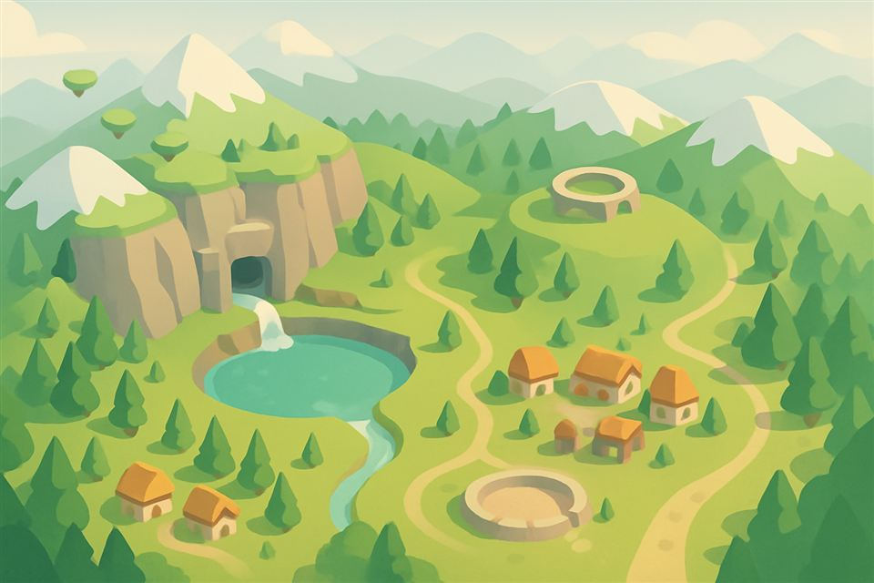 | 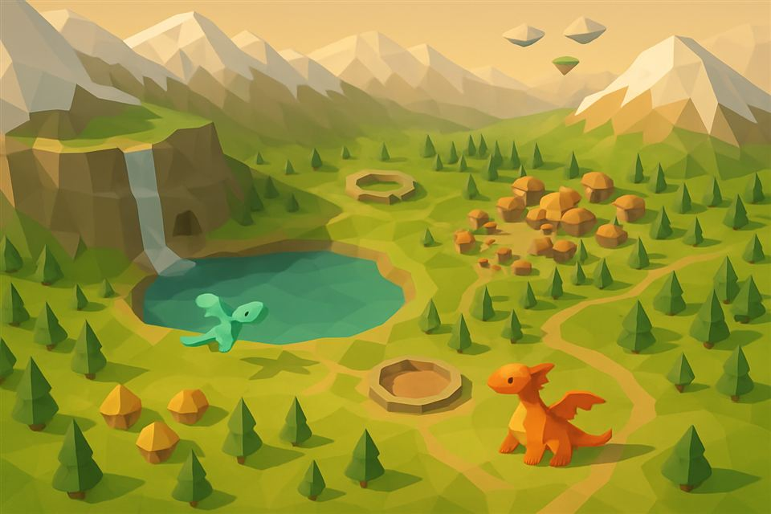 |
| 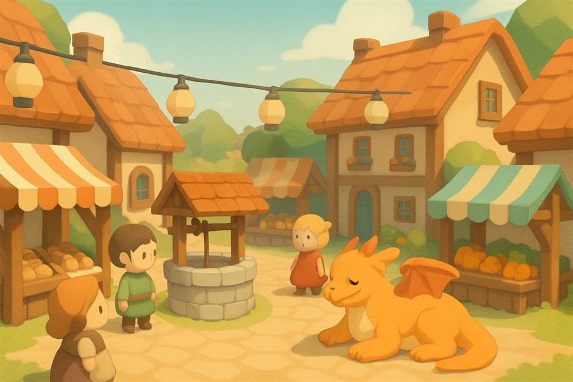 | 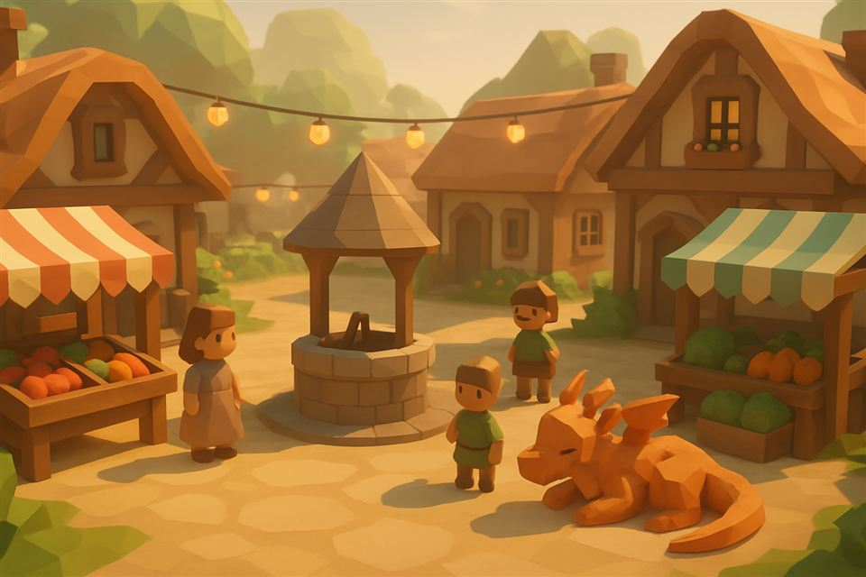 |
| 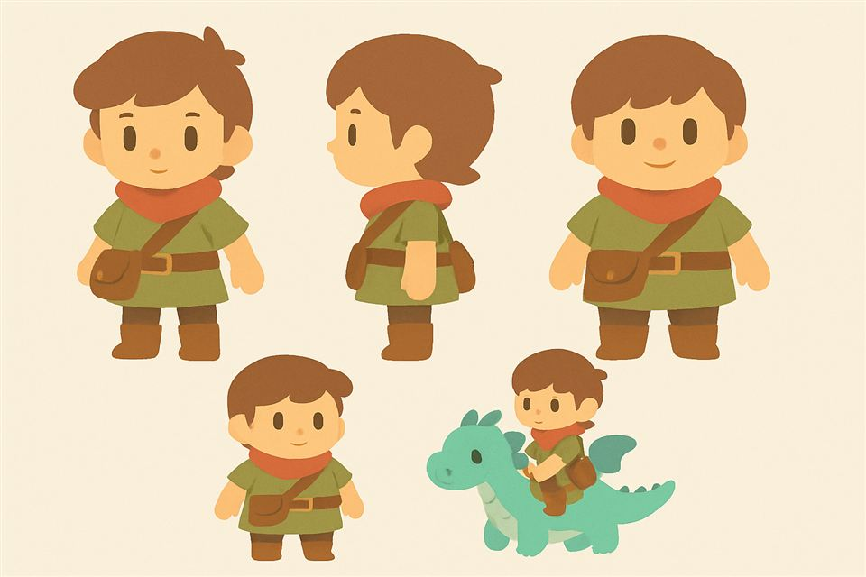 | 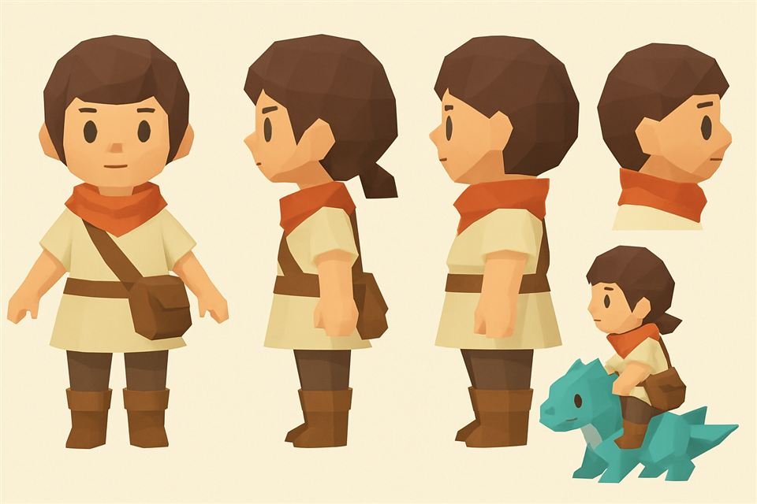 |

## The places (look A)
The den's cave mouth in its cliff, with the waterfall and a clearing to play in:
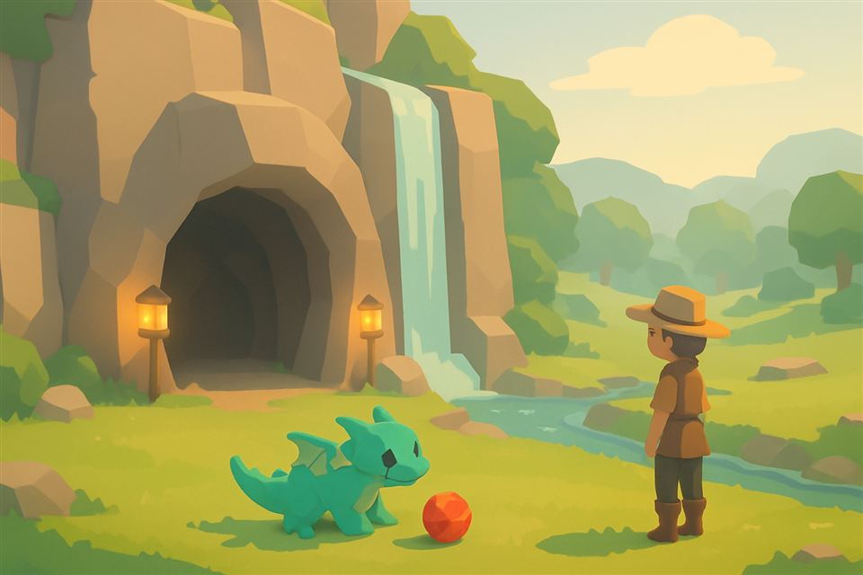

The arena: element banners, a judge's stand, crystal lanterns, rings in the sky for Sky Rings:
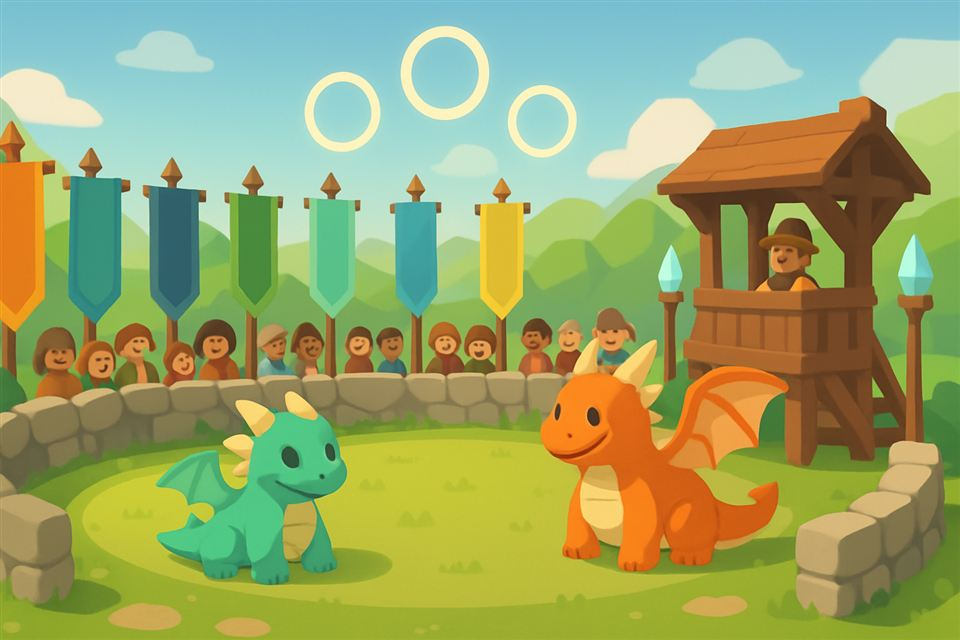

The Nesting Stone on its hilltop at golden hour:
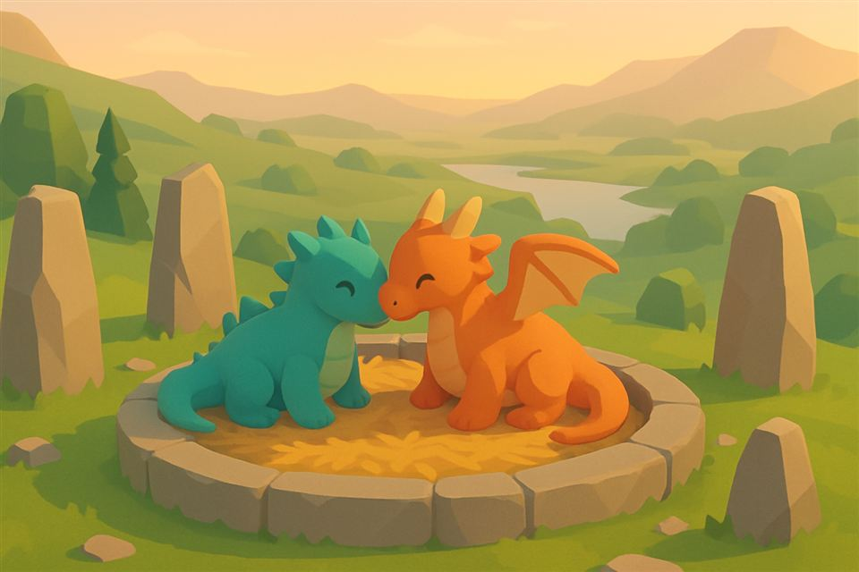

The floating islands, and riding between them:
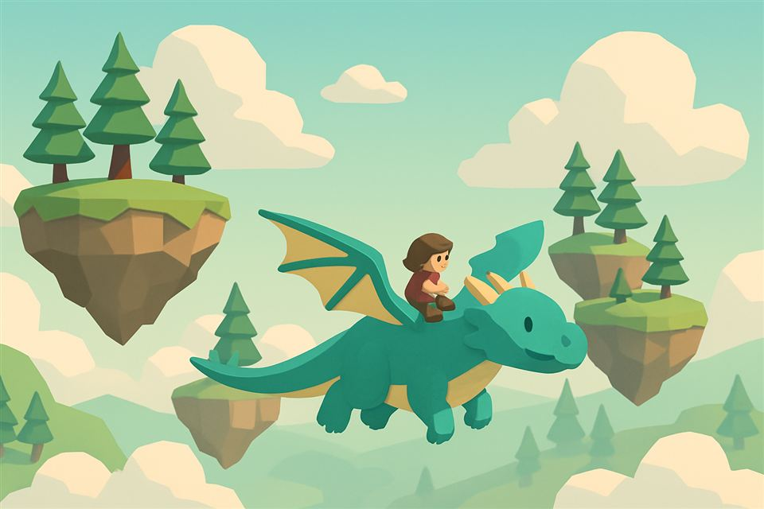

## The people (look A)
The old keeper (your guide in *The Lantern Festival*), the Market's keeper, the Sanctuary's
keeper, the arena's steward, a child with a toy dragon, the traveller:
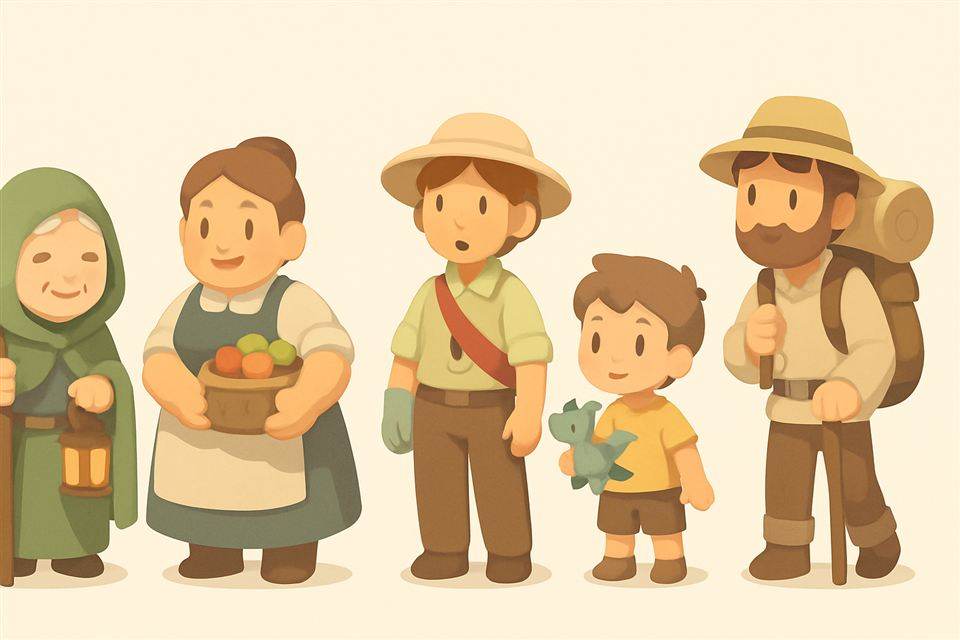

## The times of day, and the feeling
Dawn, day, dusk, night (the sky and fog follow the den's clock):
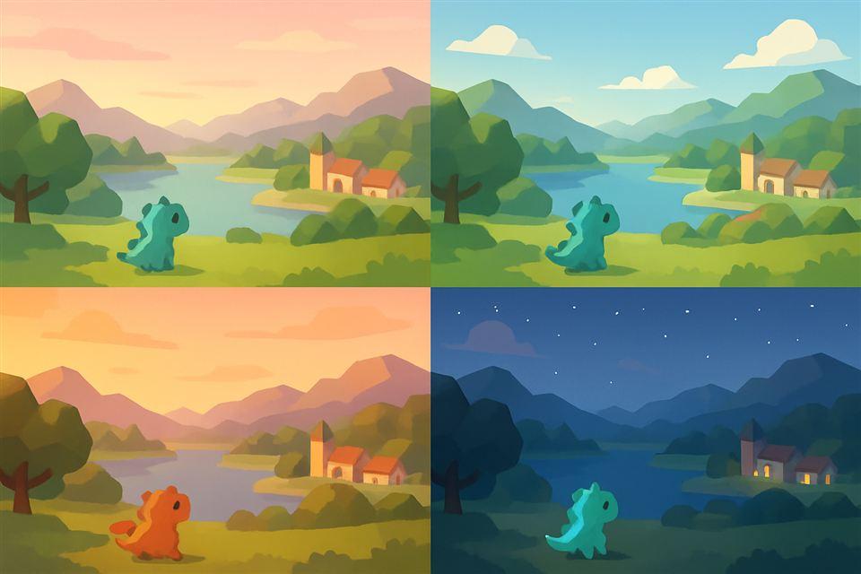

Riding home at sunset:
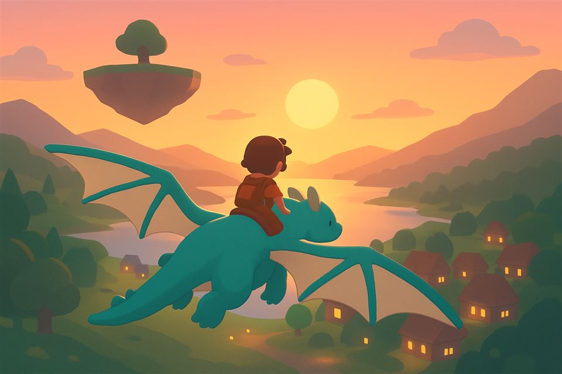

## What the engine draws today (WP1)
The flyable valley test: placeholder landscape, cone trees, fog, the day's sky, the map on
the bottom screen. The real landscape (WP3) takes its look from what you pick here.
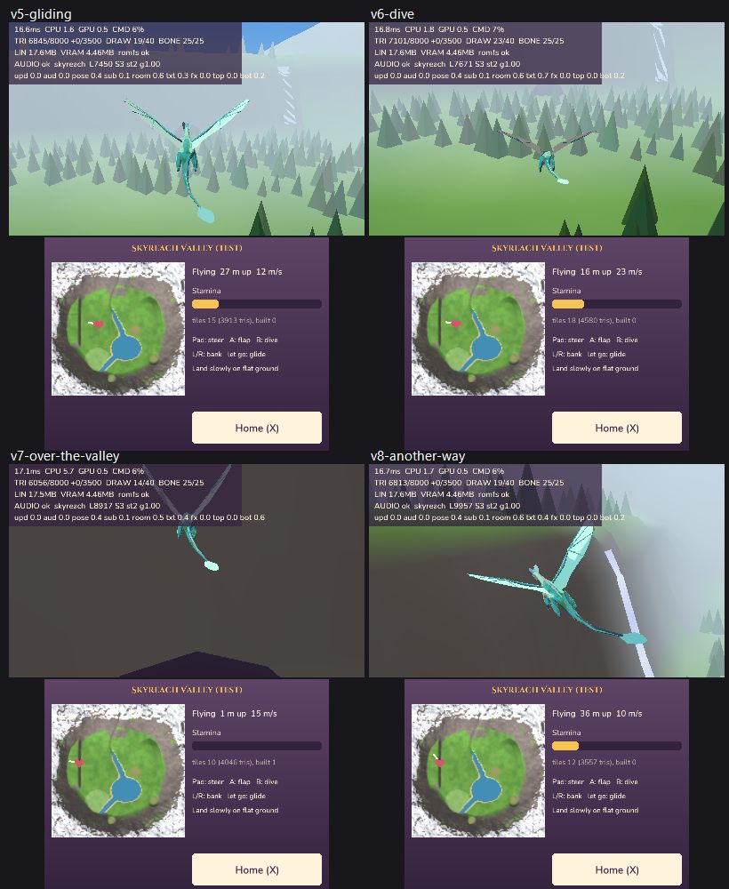

## Questions
1. **A, B, or a mix?** (for example B's faceted shapes with A's softer colours and light)
2. The places: anything to change (the den's cliff and waterfall, the village, the arena,
   the hilltop, the islands)?
3. The people: the proportions (big heads, small bodies), the outfits, the villagers' mix?
4. The palette at each time of day: warmer, cooler, more saturated?
