# A Keeper's Handbook

*Emberclutch: Skyreach Valley, the player's guide (version 1.0)*

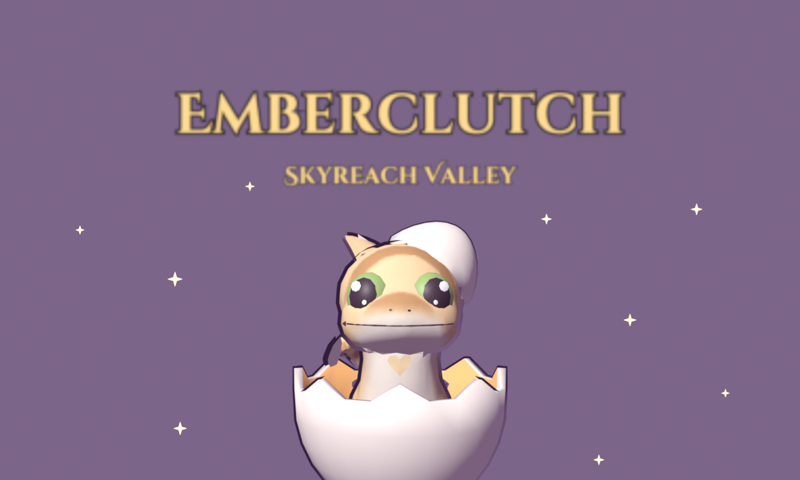

---

## Welcome to Skyreach Valley

Skyreach Valley is a green bowl of a valley ringed by lilac mountains, with a waterfall, a lake,
a market village and a few islands floating in its sky. Dragons live here alongside the people, and
every dragon has a keeper. Now one of them is you.

*Emberclutch* is a dragon life game for the Nintendo 3DS. You choose an egg, keep it warm until it
hatches, and raise the hatchling into a grown dragon over a week or so of real days. You care for it
with the stylus, walk it through the valley on its lead, ride it into the sky once it's grown, and,
if you like, train it into a champion of battles and beauty shows.

A few promises before you start:

- **Nothing ever dies.** A dragon you forget about gets lonely and sulks. It never gets ill, never
  runs away and never loses what it has learned. You make up, and you carry on.
- **It lives in real time.** The game follows your 3DS clock. Your dragon gets hungry while you're
  at school or work, sleeps when it's night where you are, and grows a little every day.
- **Short visits are enough.** A few minutes a day keeps a dragon happy. Longer sessions are for
  the valley, the league, the shows and the long walks.

*Emberclutch* was made by Noah Hicks, for Emi, who makes every day feel like hatching day. It's
free, open source and fan-made: nothing in it costs money, ever.

---

## Getting started

### Installing

You need a 3DS (any model, the original included) with custom firmware such as Luma3DS.

- **Universal Updater:** search for *Emberclutch* and install it.
- **FBI and a QR code:** in FBI choose *Remote Install*, then *Scan QR Code*, and scan the code on
  the release page.
- **By hand:** copy `emberclutch.cia` to your SD card and install it with FBI, or copy
  `emberclutch.3dsx` into `sdmc:/3ds/` and start it from the Homebrew Launcher.

**Sound** needs your 3DS's DSP firmware (`sdmc:/3ds/dspfirm.cdc`, made once with the DSP1 tool).
Without it the game runs, silently.

**Your save** lives in `sdmc:/3ds/emberclutch/`. The game keeps two copies and writes them in turn,
so a save that gets interrupted never loses both. Photos you take go in the `photos` folder beside
them.

### The two screens

Short tips pop up the first time something new comes along (the settings can show them again).
The **top screen** shows the world: your den, the valley, a battle or a show. Slide the 3D slider up
for depth (or turn the 3D off in the settings). The **bottom screen** is where your hands are: the
care tray, the needs, buttons, the map and the Journal.

### The controls

| | |
|---|---|
| **Stylus** | Pet, brush, feed, bathe and play; buttons, the map, the Journal |
| **Circle Pad** | Walk; in the den, look around |
| **A** | Whatever's near: talk, go in, light a lantern, climb on; flap when flying |
| **B** | Hold to run; dive when flying |
| **L and R** | Turn the view. Flying: R bursts ahead, L brakes |
| **X** | The Journal in the valley; in the den, an outing |
| **START** | The system menu: settings, the Dragondex, save and quit |

---

## Your egg

Every keeper starts with one egg, chosen from three:

| Egg | Hatches into | Element |
|---|---|---|
| A warm orange one | the **Pouncer**, quick and curious, always ready to pounce | Ember |
| A mossy green one | the **Puffback**, a walking hill of moss and flowers | Grove |
| A sandy grey one | the **Curlstone**, slow, steady and kind | Stone |

None is a wrong choice: every kind can do everything in the game, each in its own way.

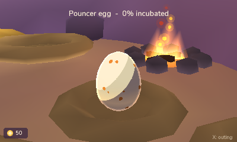

An egg needs only one thing: **warmth**. Rub it with the stylus to warm it. While it's warm it
grows, and once it has been warm for **a day and a half** it hatches. Let it cool and it simply waits
for you. Turn it gently now and then too: the dragon inside likes the attention, and it hatches already
a little fond of you. Near the end you'll hear it knock.

When it hatches you meet your dragon for the first time and give it a name (a suggestion is
already filled in, and you can rename it later). You'll also find out whether it's male or female,
and which **colouring** it has: every kind comes in four, and one of the four is rare.

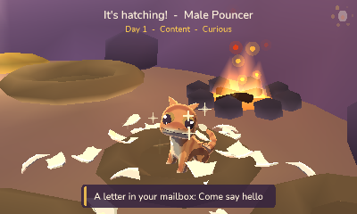

---

## Caring for a dragon

### The needs

Your dragon has four needs you look after, shown on the bottom screen, and one it looks after
itself:

| Need | What fills it | How fast it fades |
|---|---|---|
| **Belly** | Food from the tray (its favourite food fills half again as much) | Quickly awake, slower asleep |
| **Clean** | A bath | Slowly: a bath every two days or so |
| **Play** | Toys and games, walks, challenges | Steadily while it's awake |
| **Love** | Petting and brushing | Steadily while it's awake; a Shy dragon holds on to it longer |
| **Energy** | Sleep | Games, challenges and battles tire it out |

Dragons sleep at night, from **10 pm to 7 am** by your 3DS clock, and a tired dragon takes a nap on its
own in the daytime too. Sleep is the only thing that brings Energy back, so a dragon that's worn out
from a long day of games just needs to rest.

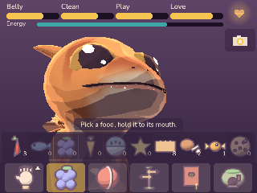

### The tray

The **tray** on the bottom screen holds everything you care with. Pick something up and the dragon
reacts to exactly where you use it:

- **Pet** it by stroking with the stylus. Head scratches, chin rubs and belly rubs each get their
  own reaction, and its heartglow pulses under your hand. Every dragon has a **sweet spot** it loves
  scratched most: find it, and its profile remembers.
- **Feed** it by dragging food to its mouth. Every dragon has a favourite food and wiggles for it.
- **Brush** it to fill its Love and shine it up, and **bathe** it when it's grubby: dust settles on
  a dragon over a day or two, and it comes home muddy from the Wanderings. Brushing lifts mud
  slowly; a bath takes everything off at once.
- **Play** with toys: toss a ball, dangle a feather, have a tug.

### The heartglow and moods

Every dragon has an ember of light in its chest, its **heartglow**, and it shows how the dragon
feels. Its mood comes from its needs, with the lowest need counting extra:

| Mood | How it shows |
|---|---|
| **Joyful** | Bright, quick sparks. It follows you about and does its best at everything |
| **Content** | A steady glow |
| **Restless** | A flicker. It paces and fidgets |
| **Sulky** | Dim. It sighs and lies down |
| **Upset** | Dim and turned away. It sits in the den's corner and won't play or compete |

A dragon gets **upset** if it stays sulky for a whole day, or if three days go by without a visit.
It's never hurt by it. To **make up**, go to it gently, offer its favourite food, and pet it until its
heartglow lights again. Bond only grows again once you've made up.

### Bond, manners and traits

**Bond** is how much your dragon trusts you, and it grows with every bit of care, every walk and
every competition. It doesn't fade: a dragon remembers.

Every dragon has a **manner**, one of ten (Brave, Shy, Playful, Proud, Sleepy, Curious, Gentle,
Mischievous, Greedy or Stubborn). A manner colours how it behaves and nudges one stat up and one a
little down (the almanac has them all). It's never a bad roll.

It also has **traits**: one or two (three on a rare colouring), from *Swift* to *Tidy* to *Night
Owl*, listed on its profile. Each does one small thing (a Tidy dragon stays clean longer, a Swift one flies
faster), and some are rare: the almanac at the back of this book lists them all.

Tap the heartglow on the bottom screen to open its **profile**: its kind and colouring, manner,
traits, level, stats, moves and record.

### Care stars and growing up

At the end of each day your dragon earns up to **three care stars**, judged by how well its needs
were kept through the day (a day without a visit earns one star at most). Stars and days together
grow it up:

| Stage | Days since hatching | Care stars | What it brings |
|---|---|---|---|
| **Hatchling** | from hatching | | Care, toys, its first walks |
| **Juvenile** | 1½ days | 3 | Bigger and bolder; the Wanderings |
| **Adolescent** | 3¼ days | 7 | Nearly grown |
| **Grown** | 5½ days | 12 | Riding and flying; breeding |

With near-perfect care a dragon is grown in five and a half days; with patchy care it takes longer,
but it never shrinks back. It changes a little every day in between: head and eyes smaller, neck,
tail, horns and wings longer, from cute to majestic.

---

## The den

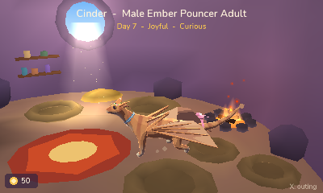

The den is a cave in the cliff beside the waterfall, and it's home. Up to **three dragons** can live
in the den at a time, with **two nests** for eggs. More dragons rest at the **Sanctuary Meadow**, where
the keepers look after them (their needs never drop below half, and they don't grow while they're
there), and spare eggs keep in the **Cold Vault** (up to fifty), where they wait without hatching.
Swap who's at home whenever you like.

- **Decorating:** the den has spots for a rug, a lantern, a perch, a plant and a banner, filled from
  what you find and buy.
- **Photos:** photo mode holds the den still for a picture and saves it to your SD card.
- **The mailbox** by the door gets letters from the valley's people now and then. A new letter
  shows on the mailbox.
- **The settings** (START): the music, the sounds and the voices, the 3D, the tips again, your look,
  and starting over.

---

## The valley

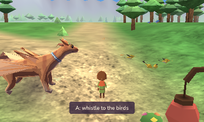

Press **X** in the den for an **outing**: make a dragon your travel partner, then head out into
**Skyreach Valley** with it on its lead. Walk with the Circle Pad, hold **B** to run, and turn the view with **L** and **R**. Walks
raise bond, Love and Play, and make a dragon hungry a little sooner. **A** does whatever's near you:
talk to someone, go in, light a lantern.

### The map

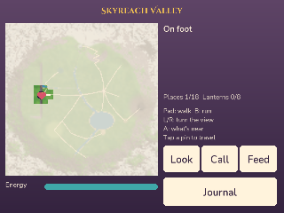

The bottom screen shows the valley's map. Places you've found are pins: **tap one to travel there at
once**, and the den's pin takes you home. The fog lifts from the map as you explore. From the start
you'll know the way to the Market Village, the Nesting Stone, the Sanctuary Meadow, the Cold Vault,
the Wanderers' Trailhead, the Arena and the Floating Isles; there are others to find.

### Day and night

The valley's light follows your 3DS clock: morning mist, bright noon, golden evenings and starry
nights. Some people keep their own hours, and some things only happen at one time of day.

### People and the Journal

The valley's villagers have their own lives, and some of them will ask for your help. Everything
you've been asked to do goes in the **Journal** (press **X**). Tap a flag in the Journal to **track**
a goal: the map then shows where to go with a gold marker, or a soft circle when it's somewhere to
search. Something's afoot in the valley, too: the **Lantern Festival** is coming, and the lanterns
need lighting. Stand by a dark lantern, press **A**, and your dragon breathes it alight.

### Finds, Gleam and the Market

Little treasures turn up about the valley every day, glinting in the grass: the **day's finds**.
**Gleam** is the valley's money (dragons love anything shiny), and you earn it from finds, challenges,
battles, shows and the Wanderings.

Spend it at the **Market Village**: food, goods that change every day, and an **egg of the day**.
Market eggs are labelled male or female, so you can find your dragon a partner on purpose. L and R move
between the stalls.

---

## Riding and flying

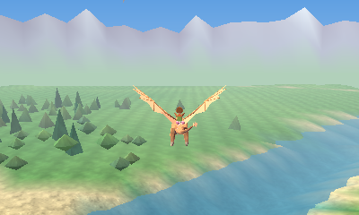

Once your dragon is **grown**, walk up to it in the valley and press **A** to climb on.

- On the ground: walk and run as on foot. **A** takes off.
- In the air: **A** flaps, climbing with every wingbeat. **B** dives. Let go of both to glide. Steer
  with the Circle Pad; **R** bursts ahead and **L** brakes.
- Land by flying low over the ground, then press **Down** to get off.

Flapping and bursting spend your dragon's **stamina**, shown while you fly; gliding and diving let it
come back. The air thins up high, so there's a ceiling to how far you can climb. A dragon's **Wing**
makes it faster and nimbler in the air, and its **Stamina** lets it fly longer. Every kind flies its
own way: quick and darting, slow and steady, or gliding for miles.

Some places in the valley can only be reached with wings.

---

## Stats and growing stronger

Every dragon has five **stats**, from its kind and its own potential, grown by training and levels:

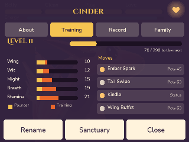

| Stat | Out and about | In a battle |
|---|---|---|
| **Wing** | Speed and agility in the air | Who goes first |
| **Wit** | Cleverness and tricks | Hitting, dodging and critical hits |
| **Might** | Strength | The power of body moves |
| **Breath** | The power of its element's breath | The power of breath moves |
| **Stamina** | Endurance: flying, playing, working | Health |

Challenges and battles bring **experience**, and every **level** adds to the stats (see them on the
profile). In Skyreach Valley a dragon can reach **level 42**.

### The elements

Each kind belongs to an **element**, and a crossbreed to two. Elements colour the heartglow, lean a
dragon's favourite food, decide its breath, and matter a lot in battles. There are eight: **Ember,
Grove, Stone, Gale, Tide, Frost, Lumen** and **Shade**.

---

## Battles: the rules

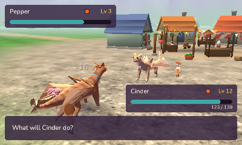

Battles are friendly duels, one dragon each, turn by turn. The valley's challengers stand about
waiting for a match; walk up and talk to them.

**A turn:** each side picks one of its **four moves**. The faster dragon (more **Wing**) usually goes
first, though a few quick moves always go first. A move can miss; Wit helps a dragon hit and dodge,
and now and then a hit lands as a **critical hit**.

**Moves** come in three sorts:

- **Body moves:** tackles, swipes and pounces, powered by Might. Most have no element; each element also
  has one body move of its own.
- **Breath moves**, in the dragon's element, powered by Breath.
- **Stat moves**, which raise your dragon's stats or lower the other's (up to two steps either way),
  or let it catch its breath and heal (once a battle).

The very strongest moves need a breather: they can't be used two turns running. A dragon learns new
moves as it levels up; choose its four on its profile.

**The elements' wheel.** Each element is strong against the next, doing **double damage**, and does
only half to the one that beats it:

> **Ember** melts **Frost** · **Frost** cracks **Stone** · **Stone** stops **Gale** · **Gale** strips
> **Grove** · **Grove** drinks **Tide** · **Tide** douses **Ember**

**Lumen** and **Shade** stand apart from the wheel, each strong against the other. Against a
dragon of two elements, both count.

**Winning:** a dragon whose health runs out is **tired out**, and the other wins. Nobody is ever
hurt: a tired-out dragon just lies down for a rest. If a battle runs long, the one with more health
left after forty turns wins. You can give up at any time. Battles cost Energy, so a worn-out dragon
needs a sleep before its next.

**The league.** The battle league has four ranks: **Ember, Flame, Blaze** and **Starfire**. Each has
four challengers about the valley; beat all four and the rank's champion waits for you at **Emberpeak
Caldera**. Win the final and the rank is yours, with a title for your dragon and the next rank's
challengers arriving. The league's **board** shows who's beaten and where to find the rest.

**Frostspire Hollow.** High in the cold heights is an ice cave where wild dragons train. Floor by
floor a wild dragon comes out, each a little stronger, and every fifth floor is a checkpoint you can
start from next time. The deeper you go, the colder it gets.

---

## Beauty shows

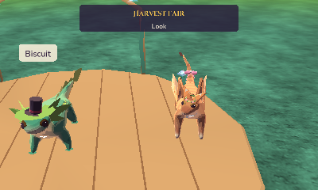

At **Moonpetal Glade**, a night garden of glowing flowers, dragons compete in themed **pageants**. Each
show has a theme that favours certain elements, colours and styles, so different dragons shine in
different shows. There are three rounds, each scored by three judges:

- **Look:** a clean dragon, dressed for the theme in things that suit its colours.
- **Poise:** bond, manner and mood, and how well it's cared for.
- **Performance:** tap the tricks in time with the music. A strong bond widens the window.

Dress your dragon from the **wardrobe**: hats, scarves and more, and dyes. Each show league (Ember to
Starfire again) has four shows, whose themes change from day to day; win all four for the league's
title. Your dragon keeps every **ribbon** it wins.

---

## Challenges

The notice board by the **Arena**'s gate lists three challenges, each with four cups from Ember to
Starfire. Win a cup to open the next.

- **Sky Rings:** a race through a course of rings in the sky against rival dragons, riding your grown
  dragon. First to the last ring wins; every ring missed adds three seconds.
- **Fruit Catch:** flick fruit up and away from the basket with the stylus (faster flicks throw
  further), and your dragon runs, leaps or dives to catch it. Eight throws; the golden pears count
  double. Young dragons play a gentler, hopping version.
- **The Lantern Trial:** crystal lanterns light up one by one in a pattern, each with its chime.
  Then tap them in the same order, and your dragon breathes each alight. A wrong one costs a heart.

Any dragon can start at the Ember cups; the higher cups of each want an older dragon. A cup pays
once a day (the first win pays most), and every go costs your dragon some Energy. Your best cups
stand in the den as **trophies**.

---

## And more

- **Fishing** at **Driftwood Cove**, on the lake's far shore: press **A** to cast, wait for the
  bobber to dip, strike, then keep the line in the band until it's in.
- **The Wanderings:** at the Wanderers' Trailhead, choose a juvenile or older dragon and set off,
  then close your 3DS and go for a walk. Your steps take it along, and every 400 steps it has a chance
  to sniff something out: Gleam, trinkets for its hoard, now and then something rarer. It comes home
  muddy and happy.
- **The Nesting Stone:** two grown dragons, a male and a female, who are happy and close to you, can
  settle at the Nesting Stone together, and the next day there's an egg. Its kind and colouring come
  from both parents, and sometimes a pair makes something new. A pair rests three days before nesting
  again. What comes of which pair is yours to find out.
- **The Dragondex** (START) fills in as you meet dragons. Find every colouring of a kind for a reward
  and a banner to hang in the den.

---

## Tips and questions

**Does it save?** The game saves on its own as you play, and when you quit from the system menu
(START, *Save & quit*). A little egg in the corner means it's saving.

**What happens while I'm away?** Time goes on as your 3DS clock says: your dragon gets hungry, sleeps
at night and grows. When you come back the game catches up (up to two weeks at most). It'll be glad
to see you.

**Can I change my 3DS clock?** Turning it back does nothing harmful: the game just counts no time.
Jumping it forward counts as time passing, no more than two weeks of it.

**My dragon is sulking.** Feed it, pet it and brush it. If it's upset, go gently, offer its favourite
food and pet it until its heartglow lights.

**It won't play or battle.** It's probably tired: a sleep (at night, or a daytime nap) brings its
Energy back.

**There's no sound.** Your 3DS needs its DSP firmware (see *Installing*).

**The 3D.** Slide it up for depth, or turn it off in the settings to save a little battery.

---

## The Keeper's Almanac: care by the numbers

The pages from here on are for keepers who like to know exactly how things work: the numbers behind the
game, straight from its code.

### The needs, hour by hour

| Need | Fades each hour awake | Asleep | Notes |
|---|---|---|---|
| **Belly** | 6 | 3 | Its favourite food fills half again as much |
| **Clean** | 1.2 | 1.2 | A bath fills it at once; dust and mud show on the dragon |
| **Play** | 4 | 1 | Playful and Mischievous dragons lose it a quarter slower |
| **Love** | 3 | 0.8 | Shy dragons lose it a fifth slower |
| **Energy** | 3 | +12 at night, +10 napping | It naps by day below 25, until 70 |

Things that spend Energy: a beauty show 10, a battle 12, a challenge 18, and den games a little.

### Moods and care stars

- **Mood** is the average of Belly, Clean, Play and Love with the lowest counted twice, less up to 10 when
  Energy is under 20. **Joyful** at 80 and up, **Content** 60 and up, **Restless** 40 and up, **Sulky**
  below that.
- A dragon becomes **upset** after 24 hours sulky, or after 3 days without a visit.
- **Care stars**, each day: the average of its lowest need over the hours it spent at home. 65 and up earns
  three stars, 40 and up two, 20 and up one. A day without a visit earns one at most.
- **Walks:** every 100 m together, Play +3, Love +2 and Belly −1.5; a bond point every 150 m.
- **The Sanctuary:** needs fade at a tenth of the speed and never drop below 50; growing up pauses.

### Breeding

Both grown, one male and one female, each with **bond 300** or more (of 1,000), both **Content** or happier
and living in the den, and neither nested in the last **3 days**. The egg comes the next day. It comes out
in the rare colouring **1 time in 20**, 1 in 10 if a parent has the rare colouring, and twice as often again
with an **Ancient Blood** parent.

### The Wanderings

A chance to find something every **400 steps** (30% more for grown dragons, and a quarter more again for
Curious or Greedy ones and for Keen Nose). Each find is Gleam (5 to 25) about half the time, a trinket for the hoard
most of the rest, and now and then a little hoard of someone else's (30 to 60 Gleam). Every 2,000 steps
there's a small chance of a wild egg (3%, or 6% for a Lucky dragon), one a trip at most.

## The Keeper's Almanac: manners and traits

### Manners

Each manner nudges one stat up a point and one down, and makes a dragon behave like one of six temperaments.

| Manner | Raises | Lowers | Behaves like | What else it does | Show Poise |
|---|---|---|---|---|---|
| **Brave** | Might | Wit | Brave | Explores and flutters | 10.5 |
| **Shy** | Wit | Might | Shy | Love fades a fifth slower; petting and brushing give double bond | 4.5 |
| **Playful** | Wing | Stamina | Playful | Play fades a quarter slower; loves games and zoomies | 9 |
| **Proud** | Breath | Wit | Proud | Poses and preens | 15 |
| **Sleepy** | Stamina | Wing | Sleepy | Sleep brings Energy back half again faster | 6 |
| **Curious** | Wit | Stamina | Curious | A quarter more Wanderings finds | 9 |
| **Gentle** | Stamina | Might | Sleepy | As Sleepy | 13.5 |
| **Mischievous** | Wing | Wit | Playful | As Playful | 7.5 |
| **Greedy** | Might | Breath | Curious | As Curious | 6 |
| **Stubborn** | Stamina | Wit | Proud | As Proud | 7.5 |

### Traits

A dragon has one or two traits (three on its rare colouring), from those its kind leans to. Rarer kinds
reach the rare tier, and only the rare colouring reaches the legendary one. Each trait does one thing:

| Trait | Tier | What it does |
|---|---|---|
| **Swift** | common | Flies 6% faster, in the valley and in Sky Rings |
| **Sturdy** | common | Games, challenges, battles and shows cost a quarter less Energy |
| **Keen Nose** | common | A quarter more chances to find something on the Wanderings |
| **Tidy** | common | Clean fades, and dust settles, 40% slower |
| **Hearty Eater** | common | Food fills its Belly a quarter more |
| **Early Riser** | common | From 7 am to noon, Play and Love fade half as fast |
| **Night Owl** | common | From 5 pm to 10 pm, Play and Love fade half as fast |
| **Sure-Footed** | common | One extra heart in the Lantern Trial |
| **Cuddly** | common | Petting and brushing build bond faster (+1 a stroke) |
| **Sunbather** | common | From 10 am to 4 pm, Love fades half as fast |
| **Water-Lover** | common | A bath also fills Play (+20) and Love (+10) |
| **Chatty** | common | Walks together build bond twice as fast |
| **Quick Learner** | uncommon | A fifth more experience from everything |
| **Strong Wings** | uncommon | Wingbeats and bursts cost a quarter less stamina; a longer race meter |
| **Treasure Hunter** | uncommon | Half again as much Gleam from the Wanderings |
| **Brave Heart** | uncommon | Moves that lower its stats fail half the time |
| **Gentle Giant** | uncommon | +6 Poise in shows |
| **Warm-Blooded** | uncommon | Frost moves do a quarter less damage to it |
| **Cool-Headed** | uncommon | Ember moves do a quarter less damage to it |
| **Deep Sleeper** | uncommon | Sleep and naps bring Energy back 30% faster |
| **Showoff** | uncommon | +6 Look in shows |
| **Loyal** | uncommon | Never upset by your being away |
| **Skydancer** | rare | Turns 15% tighter and sinks 20% slower on the glide |
| **Ironhide** | rare | Takes a tenth less damage in battles |
| **Lucky** | rare | Rare Wanderings finds (a little hoard, a wild egg) twice as likely |
| **Songbird** | rare | The show's Performance timing window a fifth wider |
| **Elemental** | rare | Breath moves of its own element hit 15% harder |
| **Glowheart** | rare | Its mood counts 5 points higher |
| **Mossback** | rare | Shows that favour Grove count it as a Grove dragon |
| **Starborn** | legendary | One more point in every stat |
| **Ancient Blood** | legendary | Its eggs come out in the rare colouring twice as often |
| **Phoenix Heart** | legendary | A sulk never turns into being upset |
| **Moonlit** | legendary | Every battle stat 10% higher from 8 pm to 6 am |
| **Sunkissed** | legendary | Every battle stat 10% higher from 9 am to 5 pm |

## The Keeper's Almanac: battles

### The elements' chart

The attacking move's element down the side, the defending dragon's element across the top: **2** is double
damage, **½** is half, a blank is normal. Against a dragon of two elements, both count (but never more than
double or less than half). Body moves with no element always do normal damage.

| | Ember | Grove | Stone | Gale | Tide | Frost | Lumen | Shade |
|---|---|---|---|---|---|---|---|---|
| **Ember** | | | | | ½ | 2 | | |
| **Grove** | | | | ½ | 2 | | | |
| **Stone** | | | | 2 | | ½ | | |
| **Gale** | | 2 | ½ | | | | | |
| **Tide** | 2 | ½ | | | | | | |
| **Frost** | ½ | | 2 | | | | | |
| **Lumen** | | | | | | | | 2 |
| **Shade** | | | | | | | 2 | |

### How a hit is worked out

- **Damage:** the move's power ÷ 100 × the attacker's Might (body moves) or Breath (breath moves) × 0.85
  × the elements' chart, then a roll of 80% to 100%, and × 1.5 on a critical hit.
- **Stat steps:** each step up adds a quarter (two steps: +50%); each step down divides by 1.25 (two: by
  1.5). Up to two steps either way. Stoneskin's guard divides the damage taken the same way.
- **Hitting:** the move's accuracy, nudged by Wit (yours against theirs: from 70% to 112% of it) and by
  Wing (a quicker foe dodges a little more: from 85% to 106%). Stat moves on yourself always work.
- **Critical hits:** 2% plus 6% × its Wit ÷ the foe's Wit, from 5% to 14%.
- **Who goes first:** a move that always strikes first (Quick Swoop), then the higher Wing; within 2% it's a
  coin toss.
- **Level:** every level adds 1.5% to each battle stat, and health another 2.5% of its first level's.
- **Stat points:** each stat is its kind's base (1 to 10, a point either way at hatching, one more all round
  on the rare colouring, the manner's nudge), plus up to 30 trained points from Frostspire Hollow's wild
  dragons (counted at half in battles), plus Starborn's point.
- **A long battle:** after 40 turns, the dragon with more of its health left wins.

### Experience and levels

A battle is worth (20 + 10 × the foe's level) experience, × (1 + 0.12 for each level the foe is above
yours), between a quarter and 1.8 times as much; more for champions and wild dragons. A loss is worth a
third; giving up, nothing. Challenges pay 20, 35, 55 or 80 (Ember to Starfire) for a paid win, and 4 for any
other finished run. The experience to reach a level is 12 × n² + 38 × n, where n is the level less one:

| Level | 5 | 10 | 15 | 20 | 25 | 30 | 35 | 42 |
|---|---|---|---|---|---|---|---|---|
| **Experience** | 344 | 1,314 | 2,884 | 5,054 | 7,824 | 11,194 | 15,164 | 21,730 |

## The Keeper's Almanac: moves

Every dragon learns the body and stat moves below, and the five moves of each of its elements, as it
levels up. The four it battles with are chosen on its profile. Moves marked *tiring* can't be used two
turns running; a heal works once a battle.

### Anyone's moves

| Move | Level | Power | Accuracy | What it does |
|---|---|---|---|---|
| **Tackle** | 1 | 45 | 100 | A running bump |
| **Claw Swipe** | 3 | 50 | 95 | A quick swipe of the claws |
| **Roar** | 4 | | 90 | Lowers the foe's Might a step |
| **Quick Swoop** | 5 | 40 | 100 | Always strikes first |
| **Tail Swipe** | 7 | 60 | 90 | A sweep of the tail |
| **Preen** | 8 | | 100 | Raises its Wit a step |
| **Wing Buffet** | 11 | 60 | 95 | A clap of both wings |
| **Rest** | 14 | | 100 | Heals 35% of its health, once |
| **Headbutt** | 16 | 75 | 85 | Head down and charge |
| **Flex** | 20 | | 100 | Raises its Might a step |
| **Crushing Pounce** | 30 | 90 | 85 | All its weight; tiring |

### Each element's moves

At level 1 a first breath (power 45, accuracy 100); at 9 its own stat move; at 12 a stronger breath (65,
95); at 18 a body move of its element, powered by Might (70, 90); at 26 its great breath (90, 85, tiring).

| Element | Level 1 | Level 9 | Level 12 | Level 18 | Level 26 |
|---|---|---|---|---|---|
| **Ember** | Ember Spark | Kindle: its Breath up a step | Flame Breath | Blaze Claw | Inferno |
| **Grove** | Seed Spit | Mossy Mend: heals 30%, once | Spore Burst | Vine Lash | Bramble Storm |
| **Stone** | Grit Spray | Stoneskin: guard up a step | Sand Blast | Stone Slam | Rockfall |
| **Gale** | Gust | Tailwind: its Wing up two steps | Cyclone | Wing Cutter | Tempest |
| **Tide** | Bubble Spray | Drench: the foe's Breath down a step | Water Jet | Wave Crash | Tidal Surge |
| **Frost** | Frost Puff | Chill: the foe's Wing down a step | Icy Breath | Frost Fang | Blizzard |
| **Lumen** | Glimmer | Dazzle: the foe's Wit down a step | Radiant Beam | Sunflare Strike | Starburst |
| **Shade** | Dusk Puff | Shadow Veil: its Wit up two steps | Umbral Breath | Shadow Pounce | Eclipse |

## The Keeper's Almanac: challenges and shows

### The cups and what they need

| | Ember | Flame | Blaze | Starfire |
|---|---|---|---|---|
| **Sky Rings** | A grown dragon; beat 2 rivals | Ember won; beat 3 | Flame won; beat 3 | Blaze won; beat 3 |
| **Lantern Trial** | Any dragon | Ember won | Flame won; juvenile or older | Blaze won; grown |
| **Fruit Catch** | Any dragon; 1,100 points | Ember won; 1,600 | Flame won, juvenile or older; 2,050 | Blaze won, grown; 2,400 |

Younger dragons play Fruit Catch's hopping version for 800, 1,150 and 1,500 points. In Sky Rings, every ring
missed adds three seconds, and the race ends at two and a half times the course's par.

| Lantern Trial | Lanterns | Rounds | Pattern | Hearts | Each lantern lit for |
|---|---|---|---|---|---|
| **Ember** | 4 | 4 | 2 to 5 | 3 | 0.85 s |
| **Flame** | 5 | 5 | 3 to 7 | 3 | 0.72 s |
| **Blaze** | 6 | 5 | 4 to 8 | 2 | 0.6 s |
| **Starfire** | 6 | 6 | 5 to 10 | 2 | 0.5 s |

| Gleam | Ember | Flame | Blaze | Starfire |
|---|---|---|---|---|
| **A cup's first win** | 80 | 140 | 220 | 350 |
| **A win again (once a day)** | 30 | 45 | 65 | 90 |
| **Placing (while the day's prize is still to win)** | 10 | 15 | 20 | 30 |

### How shows are judged

Three judges score each round out of 100; the most points over the three rounds wins.

- **Look:** clean (20), dressed for the theme (25: 8 for each thing worn that has one of the theme's styles,
  2 for others), its colours in the theme's (15), what it wears suiting its colours (10, or 3 wearing
  nothing), how rare its kind is (common 4, harder to find 7, rare 10, and 2 more for the rare colouring),
  and its element (18 if the theme favours its first element, 11 its second). Showoff adds 6.
- **Poise:** bond (35, growing fast at first), manner (up to 15: see the manners' table), mood (Upset 0,
  Sulky 4, Restless 10, Content 19, Joyful 25) and care (25, full at 30 care stars). Gentle Giant adds 6.
- **Performance:** tap each cue in time. A perfect tap is within 0.075 seconds, a good one within 0.17; a
  strong bond widens both by up to 60% (Songbird by a fifth more). Longer streaks score more.

| Theme | Favours | Styles |
|---|---|---|
| **Frost Ball** | Frost, Tide, Lumen | Frosty, Elegant |
| **Harvest Fair** | Grove, Stone | Floral, Wild |
| **Starlight Gala** | Lumen, Shade, Gale | Starry, Elegant |
| **Ember Carnival** | Ember, Stone | Fiery, Festive |
| **Tide Regatta** | Tide, Gale | Cute, Festive |
| **Blossom Festival** | Grove, Lumen | Floral, Cute |
| **Shadow Masquerade** | Shade, Ember | Elegant, Wild |
| **Sunrise Parade** | Ember, Lumen, Gale | Starry, Fiery |

| Gleam | Ember | Flame | Blaze | Starfire |
|---|---|---|---|---|
| **A show's first win** | 50 | 90 | 140 | 220 |
| **A win again (once a day)** | 20 | 30 | 45 | 60 |
| **Second / third place** | 12 / 6 | 18 / 10 | 25 / 14 | 35 / 20 |
| **Winning the league** | 100 | 200 | 350 | 500 |

---

## Credits and licences

*Emberclutch: Skyreach Valley* was made by **Noah Hicks**, with Claude (Anthropic) writing much of the
code and tools. Inspired by Emi.

- Code: MIT licence. Original art and assets: CC BY-SA 4.0. Music and generated sound effects: their
  own terms. See the repository for the full credits and licences.
- Fonts: Nunito and Cinzel Decorative (renamed in the game), under the SIL Open Font License.
- Built with devkitPro, libctru, citro2d and citro3d.

*Emberclutch* is a fan-made homebrew project, not affiliated with or endorsed by Nintendo. "Nintendo
3DS" is a trademark of Nintendo.
